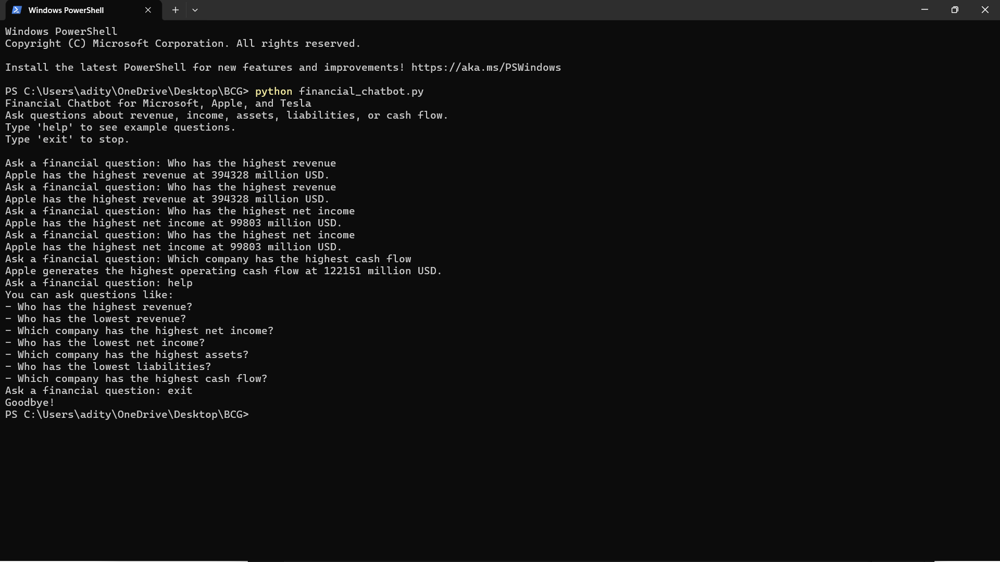

# AI Financial Chatbot – BCG GenAI Job Simulation

This project was developed as part of the **BCG GenAI Job Simulation on Forage**.

The objective of the task was to analyze financial data from corporate reports and build a **financial chatbot** capable of answering queries about company performance.

After completing the required simulation task, the project was **independently upgraded** to include an **AI-powered chatbot using a Large Language Model (LLM)** with a fallback analysis system.

---

# Project Overview

The project analyzes financial data from major companies and uses that information to power a chatbot capable of answering financial questions.

Companies analyzed:

- Microsoft
- Apple
- Tesla

Financial metrics used:

- Total Revenue
- Net Income
- Total Assets
- Total Liabilities
- Operating Cash Flow

The chatbot reads structured financial data and responds to queries about financial performance.

---

# Version 1 — Rule-Based Financial Chatbot (Forage Requirement)

The original version of the chatbot was implemented using **rule-based logic in Python**.

It answers predefined queries by analyzing financial data using conditional logic.

### Example queries

- Which company has the highest revenue?
- Which company has the lowest revenue?
- Which company has the highest net income?
- Which company has the highest operating cash flow?

The chatbot retrieves the relevant information from the dataset and returns the appropriate financial insight.

---

## Rule-Based Chatbot Demo



---

# Version 2 — AI-Powered Financial Chatbot (Project Upgrade)

After completing the simulation task, the chatbot was **extended into an AI-powered system** using a Large Language Model.

This upgraded version allows the chatbot to understand **natural language financial questions**, making it more flexible and intelligent than the rule-based version.

### Improvements implemented

- Integration with **Google Gemini LLM**
- Ability to interpret natural financial questions
- AI-generated financial comparisons and explanations
- Improved conversational interaction

Example queries the AI version can answer:

- Compare Apple and Microsoft revenue
- Which company has stronger financial performance?
- Explain the financial differences between Tesla and Microsoft
- Which company appears financially strongest based on this dataset?

---

# Fallback Analysis System

During development, it was discovered that API limits or quota restrictions could prevent the AI model from responding.

To solve this, a **local financial analysis fallback system** was implemented.

If the LLM API becomes unavailable, the chatbot automatically switches to local dataset analysis to ensure the system continues to function.

This demonstrates an important AI engineering principle: **building reliable systems even when external services fail**.

---

# Technologies Used

- Python
- Pandas
- Jupyter Notebook
- Rule-based Natural Language Processing
- Google Gemini API (LLM)

---

# Project Structure

```
ai-financial-chatbot-bcg
│
├ ai_chatbot
│   └ gemini_financial_chatbot.py
│
├ rule_based_chatbot
│   ├ financial_chatbot.py
│   └ chatbot_demo.png
│
├ dataset
│   └ financial_data.csv
│
├ analysis
│   └ bcg_financial_analysis.ipynb
│
└ README.md
```

---

# Skills Demonstrated

- Financial data extraction and preprocessing
- Financial data analysis using Python
- Rule-based chatbot development
- Large Language Model integration
- AI system design with fallback mechanisms
- Data-driven financial insight generation

---

# Author

Aaditya Shimpi

This project was completed as part of the **BCG GenAI Job Simulation on Forage** and independently extended to explore **AI-powered financial analysis systems**.
